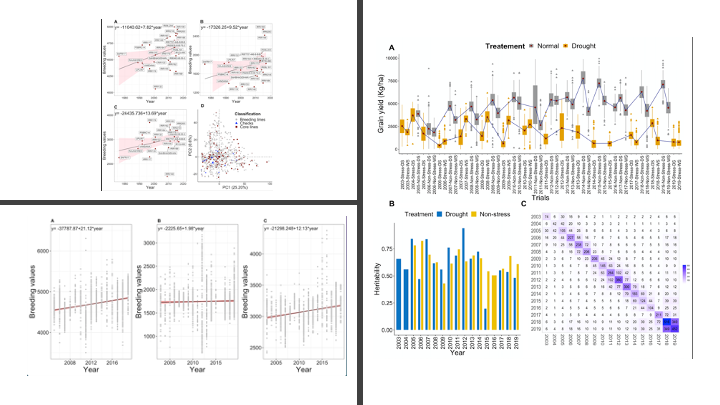

# General 
This repository  contains all the scripts used to estimate the genetic trends in IRRI's Rice drought breeding program. 

# AIM
In this work 17 years of historical data was leveraged to estimate genetic trends and also formulate the breeding panel as a future breeding resource.  The Manucript entitled "Genetic Trends Estimation in IRRIs Rice Drought Breeding Program and Identification of High Yielding Drought Tolerant Lines" is available as a pre-print at [Link will be updated soon](). 

***
# Content of the repository
***

- Raw data files will be shared upon the request with information given in **Data folder**.
- All the figures generated are in the **Figures** folder.
- **html** folder contains the html file containing all the R scripts.
- R scripts are also given as ***.rmd*** files in rmd folder

- [R Scripts_HTML](https://htmlpreview.github.io/?https://github.com/whussain2/vGWAS/blob/master/HTML_files/Genetic_Trend_Drought_Rice_IRRI.html)
- [.rmd](https://github.com/whussain2/vGWAS/blob/master/RMD_files/Genetic_Trend_Drought_Rice_IRRI.Rmd)

# Contact
You may contact the author of this repository, Waseem Hussain at <waseem.hussain@irri.org>; <waseemhussain907@gmail.com> and Apurva Khanna at <a.khanna@irri.org >

